# GUI-Java
A complete java code for creating GUI frames consist of text boxes and buttons.

<pre>
Step By Step Explanation
Step-1 Creating a simple frame.
Step-2 Creating object of JLabel for “Printer: MyPrinter”.
Step-3 Creating object of JList for three empty list boxes.
Step-4 Creating CheckBoxes ( image, text, Code, Print to File).
Step-5 Creating RadioButtons ( Selection, All, Applet ).
Step-6 Creating ComboBox (High, Medium, Low).
Step-7 Creating Buttons ( Ok, Cancel, Setup, Help) and showing dialog message on click

</pre>

**Step-1: JFrame**

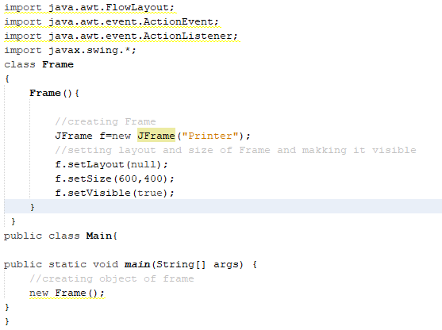

**Output**

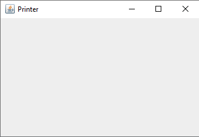

**Step-2: JLabel**

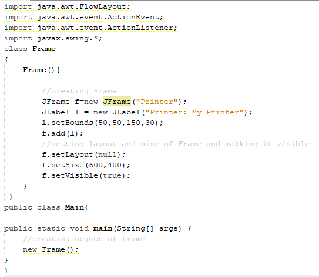

**Output**

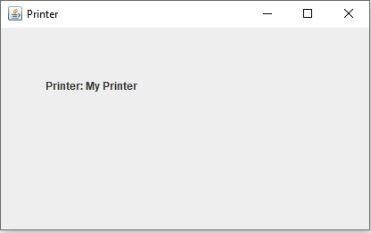

**Step-3: JList**

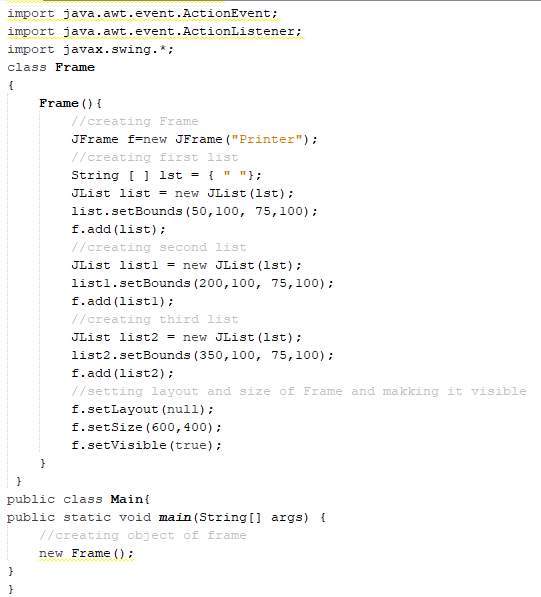

**Output**

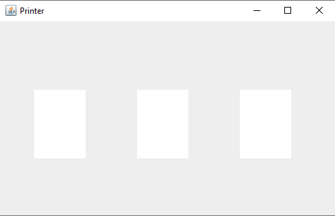

**Step-4: JCheckBox**

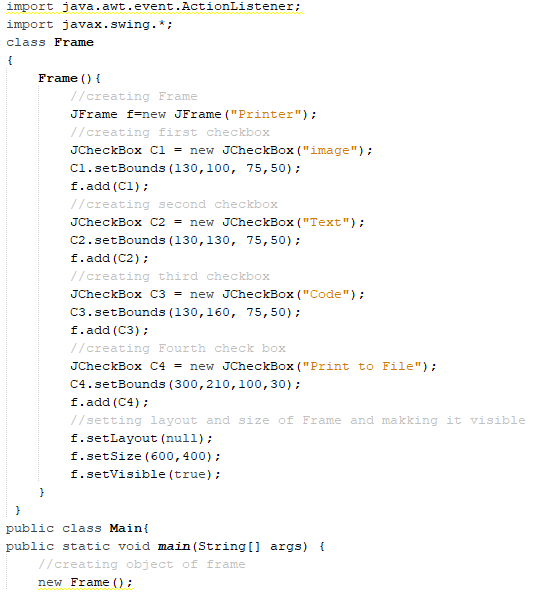

**Output**

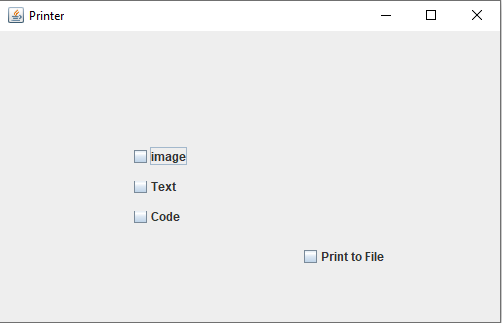

**Step-5: JRadioButton**

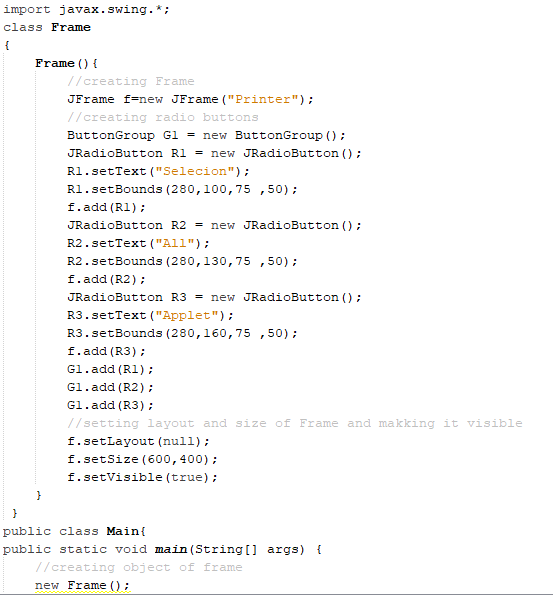

**Output**

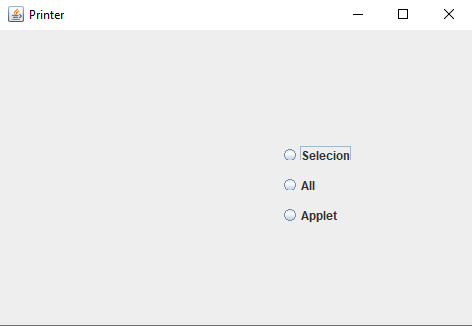

**Step-6: JComboBox**

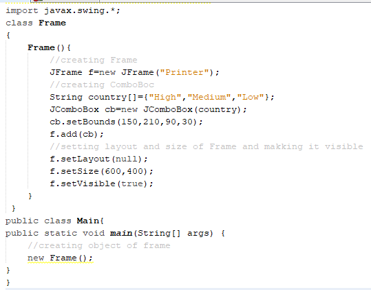

**Output**

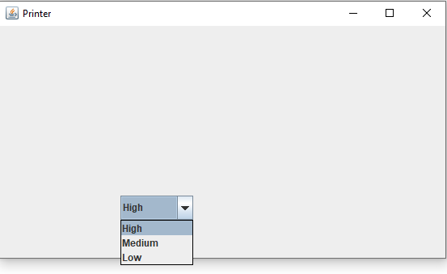

**Step-7: JButton & JOptionPane**
<pre>
Creating four buttons along message dialog.First create object of JButton and then 
through action listener, show message dialog.

  JButton: Creating Buttons
  JOptionPane: Showing Dialog Message
  
1st-Button: First button is ‘Ok’.
2nd-Button: Second Button is ‘Cancel’.
3rd-Button: Third Button is ‘Setup’.
4th-Button: Fourth Button is Help.
</pre>

**1st-Button 'Ok'**
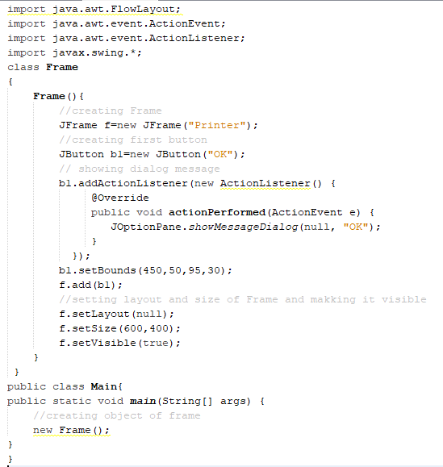

**Output**

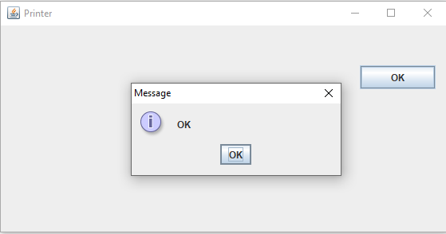

**2nd-Button “Cancel”**
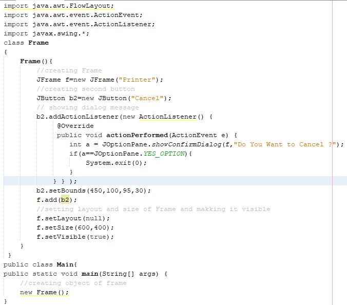

**Output**

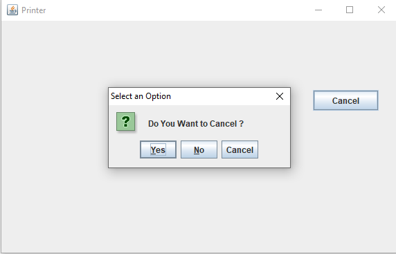

**3rd-Button “Setup”**
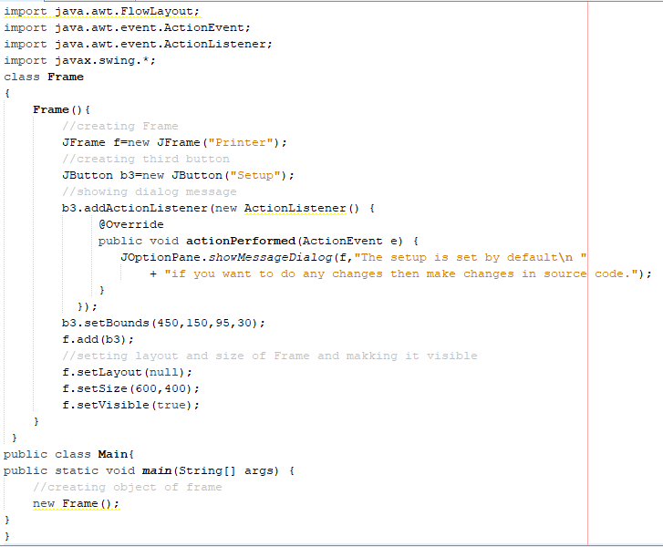

**Output**

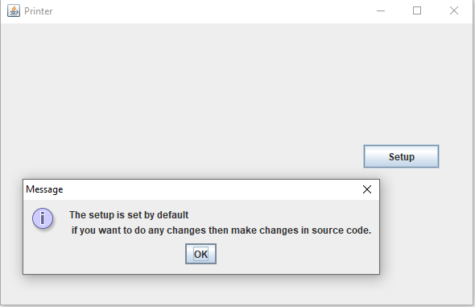

**4th-Button “help”**
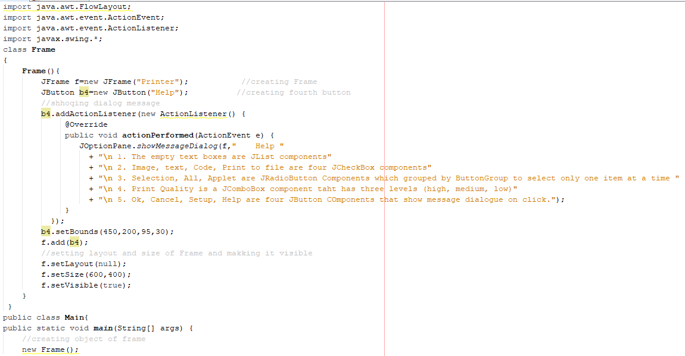

**Output**

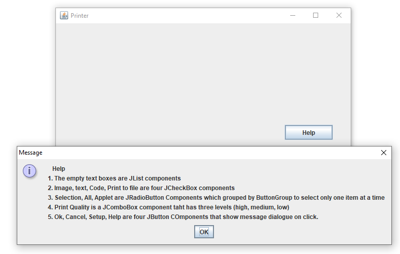

